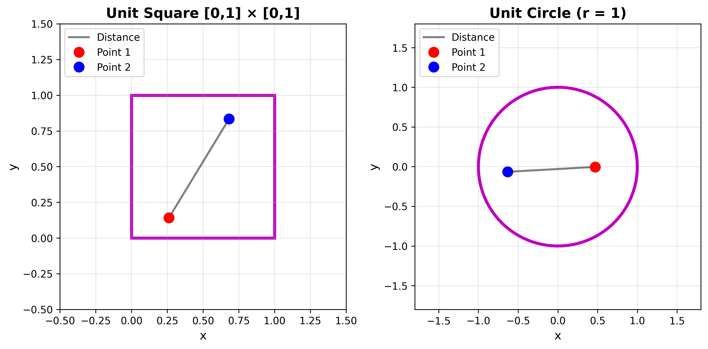
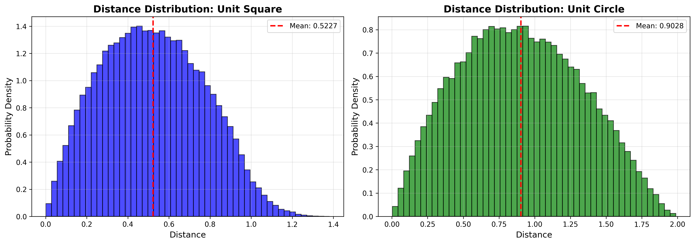
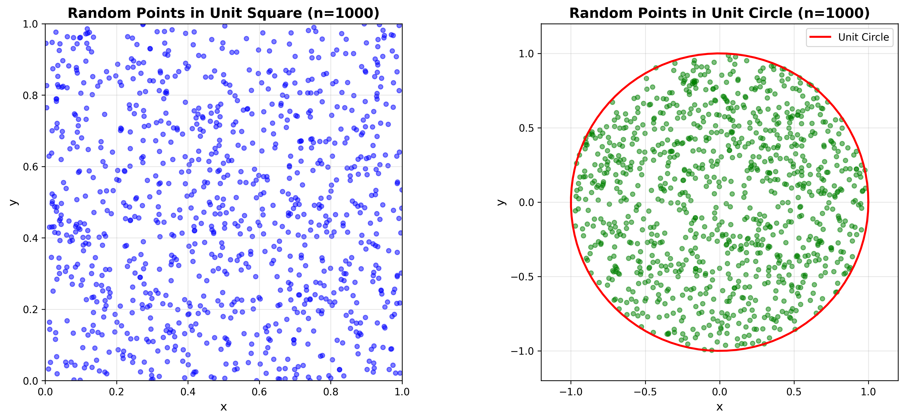

# Monte Carlo Methods for Geometric Probability

A computational approach to solving the classic problem(s): 
What is the average distance between two random points in a unit square? A unit circle?

## The Problem



**Unit Square:** If you randomly pick two points in a square with sides of length 1, what is the expected distance between them?

**Unit Circle:** What about if the points are in a circle with radius 1?

These problems are difficult to solve analytically (they require advanced multivariable calculus). [Monte Carlo simulations](https://www.ibm.com/think/topics/monte-carlo-simulation) can be used to obtain an elegant computational solution.

## Monte Carlo Approach

Instead of solving using calculus, we can apply the Monte Carlo method:
1. Generate 100,000 pairs of random points
2. Calculate the distance for each pair
3. Average all the distances

This approximates the analytical solution with high levels of accuracy.

## Results

| Geometry | Monte Carlo Result | Analytical Value | Error |
|----------|-------------------|------------------|-------|
| Unit Square | ~0.52175 | [0.521405](https://mathworld.wolfram.com/SquareLinePicking.html) | <0.07% |
| Unit Circle | ~0.90575 | [0.905414](https://mathworld.wolfram.com/DiskLinePicking.html) | <0.04% |

*Note: Monte Carlo results can vary slightly between runs due to randomness.*

## Implementation

### Core Algorithm
```python
distances = []
for i in range(100000):
    point1 = random_point_in_square()
    point2 = random_point_in_square()
    distance = calculate_distance(point1, point2)
    distances.append(distance)

average_distance = mean(distances)
```

### Key Techniques
- **Random sampling:** Generating uniform random points
- **Rejection sampling:** For uniform distribution within circles
- **Convergence analysis:** Demonstrating the Law of Large Numbers
- **Statistical visualization:** Plotting distributions and convergence

## Files

- `monte_carlo_geometry.py` - Core Monte Carlo simulation functions
- `visualizations.py` - Plotting and visualization code  
- `README.md` - This file
- `requirements.txt` - Python dependencies

## Installation & Usage
```bash
# Setup
python3 -m venv venv
source venv/bin/activate
pip install -r requirements.txt

# Run simulations
python monte_carlo_geometry.py

# Generate visualizations
python visualizations.py
```

## Visualizations

The code generates three plots:

<div style="display: flex; justify-content: space-between;">
  
  
  
</div>

1. **Distance Distributions** - Histograms showing how distances are distributed
2. **Convergence Plot** - Demonstrates how accuracy improves with more samples
3. **Sample Points** - Visual representation of random point generation

## Mathematical Background

Monte Carlo methods rely on the **[Law of Large Numbers](https://en.wikipedia.org/wiki/Law_of_large_numbers)**: as sample size increases, the sample average converges to the expected value.

Standard error decreases at a rate **proportional** to 1/√n:
- 100 samples → ±10% error
- 10,000 samples → ±1% error
- 100,000 samples → ±0.1% error

## Applications of Monte Carlo Methods

- Financial modeling (options pricing, risk analysis)
- Physics simulations (particle interactions, quantum mechanics)
- Machine learning (reinforcement learning, Bayesian inference)
- Computer graphics (ray tracing, global illumination)

## Author

**Robert Tran**  
Applied Mathematics & Computer Science  
San Diego State University